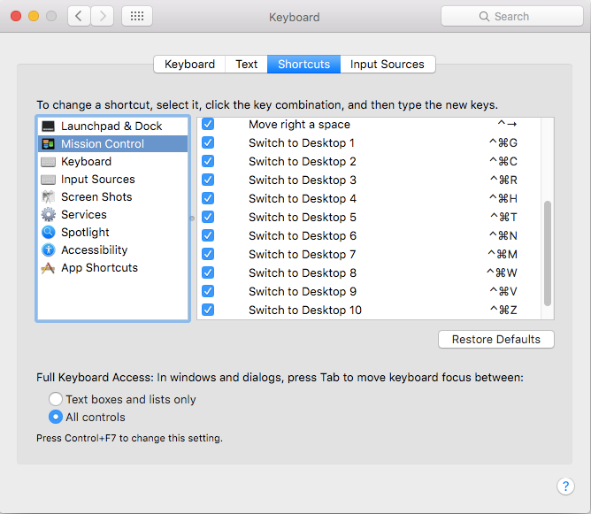

OSX App-Spaces Manager
======================

Run Apps and Spaces(Desktops) related tasks in OSX. If you want to open to open
specific app in a specific space via command line, that's a good place to start.

Installation
------------

```shell
npm install -g osx-app-spaces-manager
```

Configuration
-------------

### 1. Set up spaces shortcuts

There is no direct API for switching spaces in OSX, so we have to use hack to
switch spaces via shortcuts. Go to:

`System Prefereces` → `Keyboard` → `Shortcuts` → `Mission Control`

And make sure you've got shortcuts there.



### 2. Create configuration file

Create `.osx-app-spaces-config.js` in your home dir. You can use coffeescript as
well for that. File should export a config object i.e:

```js
config = {
  essentialApps: [...],
  ensureKillApps: [...],
  ensureRunningApps: [...],
  spaceActions: {...},
  spaceKeys: [...]
};

module.exports = config; ``` Notice `spaceKeys`, it's the array with keys for
switching to spaces from first to the last. As per screenshot it will be equal
to:

```js
{
  spaceKeys: [
    [ 'g', { using: ['command down', 'control down'] } ],
    [ 'c', { using: ['command down', 'control down'] } ],
    [ 'r', { using: ['command down', 'control down'] } ],
    [ 'h', { using: ['command down', 'control down'] } ],
    ...
  ]
```

Note, because arrays in JS start with 0, Space 0 is same as Desktop 1 in OSX.

You can use `command down`, `‌control down`, `‌option down`, `‌shift down` as key
modifiers(it comes from AppleScript/System Events Dictionary/keystroke).

Ok, the next thing you would want to setup is `spaceActions`. `spaceActions` are
actions you would want to do for each specific space. It, is an object
containing functions for each space in format:

{
  spaceActions:
    3: function(options, done) {
      done();
    },
    4: function(options, done) { // OSX Desktop 5
      done();
    }
}

`options` right now doesn't contain anyhing. And `done` should be called when
you finish doing your actions on specific space. Thus you can have nested
callbacks inside. You can define as many `spaceActions` as you want, and skip
defining if you don't want any actions for specific space

About rest options(`essentialApps`, `ensureKillApps`, `ensureRunningApps`),
written lower in the page.

Usage
-----

Run the action for specific space:

```shell
osx-app-spaces-manager -s=3
```

Run all the actions for all spaces in order. For example this way you can
prepare your working enivronment on startup: open editor, browser, else. Usually
it takes time to finish the action, so you probalbly will need to play with
delays to avoid glitches:

```shell
osx-app-spaces-manager -i
```

Run shell command on each space, for example [set up wallpaper](https://github.com/sindresorhus/wallpaper-cli):

```shell
osx-app-spaces-manager --each-space="wallpaper '$HOME/.wallpaper.png'"
```

Kill all non essential apps(`essentialApps`) which has got windows and all the
apps from the list `ensureKillApps`:

```shell
osx-app-spaces-manager -k
```

Run the applications from the list `ensureRunningApps`:

```shell
osx-app-spaces-manager -r
```

Example of config you can find [here][config-example]

---

Originally extracted from [welldan97/dotfiles][welldan97-dotfiles]

[config-example]: https://github.com/welldan97/dotfiles/blob/master/dotfiles/osx/.osx-app-spaces-config.coffee
